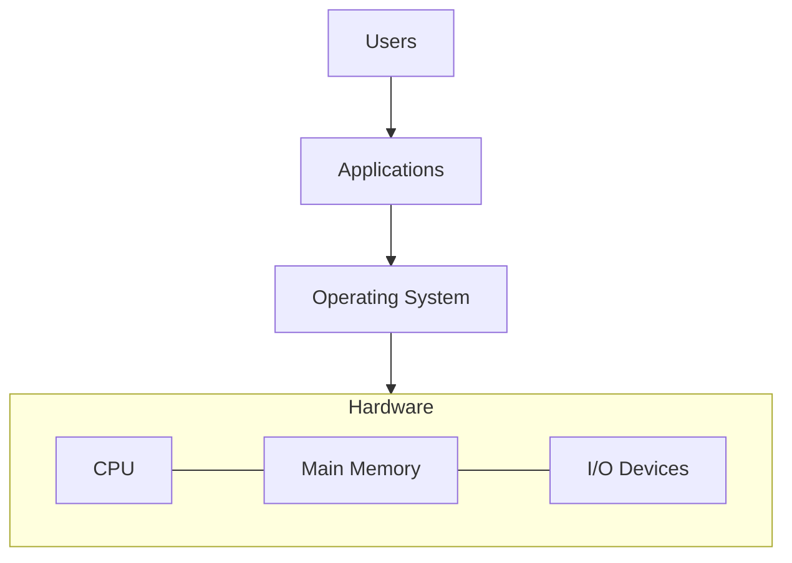

# Operating System

## 운영체제란

**운영체제(OS)는 컴퓨터 하드웨어 자원을 관리**하고, 사용자/응용프로그램에  
**안전하고 편리한 실행 환경(추상화)을 제공하는 시스템 소프트웨어다.**

- **좁은 정의**: OS ≒ **커널**(항상 메모리에 상주하며 CPU, 메모리, I/O를 직접 관리하는 핵심)
- **넓은 정의**: **시스템 프로그램**(셸, 유틸리티, 서비스 등), 경우에 따라 **미들웨어**까지 포함하기도 함

운영체제의 3가지 관점
- **Referee(심판)**: 보호/격리, 권한 검사, 공정성
- **Illusionist(환상)**: 가상 메모리, 가상 CPU, 파일이라는 추상화
- **Resource Manager(관리자)**: CPU/메모리/디스크/네트워크 **할당, 회수, 회계**

## 운영체제가 할 일

컴퓨터 시스템은 보통 **하드웨어, 운영체제, 응용 프로그램, 사용자**로 구분한다.  
운영체제는 **하드웨어 자원을 다중 사용자, 다중 프로그램이 안전하고 효율적으로 쓰도록 조정**한다.

- **하드웨어**: CPU, 메모리, I/O 장치(디스크, 네트워크, GPU 등) - 원시 계산 자원 제공
- **운영체제**: 자원 보호/할당, 추상화 제공(파일, 프로세스, 소켓 등)
- **응용 프로그램**: 사용자 요구를 구현(브라우저, DB, 서버 등)
- **사용자**: 사람, 서비스, 다른 시스템

### 사용자 관점

**사용되는 인터페이스**에 따라 OS에 대한 기대가 달라진다.

| 인터페이스/환경      | 사용자 기대              | OS 포인트                             |
| ------------- | ------------------- | ---------------------------------- |
| 데스크톱(키보드/마우스) | 빠른 **응답성**, 안정성     | 선점형 스케줄링, 페이지 캐시, GUI 서브시스템        |
| 모바일/터치        | **전력 효율**, 백그라운드 제어 | 전원 관리, 앱 수명주기/샌드박스                 |
| 음성/임베디드       | **실시간성**/**예측가능성**  | RT 스케줄러(RM/EDF), 드라이버 지연 최소화       |
| 서버/클라우드       | **처리량/지연** 최적화, 격리  | cgroups/namespace, NUMA, I/O 스택 튜닝 |

### 시스템 관점 (Resource Allocator & Control Program)

운영체제는 하드웨어와 가장 밀접한 프로그램으로서,

- **Resource Allocator**: 요청 간 **자원 할당/회수/회계**를 결정
- **Control Program**: **프로그램 실행과 I/O 동작을 제어, 부적절한 사용을 방지**(권한, 격리, 보호)

###  운영체제 구성 

- **커널(Kernel)**: 항상 실행중이며, 트랩/인터럽트 처리,스케줄링, 메모리 관리, 파일/디바이스 관리 수행
- **시스템 프로그램(System Programs)**: 셸, 파이프라인 도구, 서비스(로그, 네트워크, 초기화 등)
- **미들웨어(Middleware)**: 응용 개발을 돕는 공통 서비스(프레임워크, RPC, 앱 프레임워크)
  - **플랫폼에 따라 OS가 포함되기도/아니기도 함**

