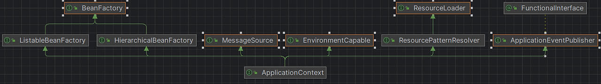

# ApplicationContext

## 요약
- **ApplicationContext**는 스프링 **IoC 컨테이너의 대표 인터페이스**로, Bean 관리(BeanFactory), 리소스 로딩(ResourceLoader), i18n(MessageSource),
이벤트 발행(ApplicationEventPublisher), 패턴 리소스 매칭(ResourcePatternResolver)를 **한데 묶은 런타임 허브**다.
- Boot에서는 `SpringApplication`이 환경과 앱 타입(MVC/Reactive/None)에 맞는 **적절한 컨텍스트 구현체**를 선택, 생성하고 `refresh()`로 전체 라이프사이클을 구동한다.
- `refresh()`는 **빈 정의 로딩 -> 후처리기(BFPP/PP) 적용 -> 싱글톤 초기화 -> 라이프사이클 시작/이벤트 발행** 순으로 진행된다.

## 무엇이, 왜 필요할까

### 역할
- Bean **정의/생성/주입/소멸**을 통합 관리한다.
- 설정, 메시지, 리소스, 이벤트, 프로파일, 스코프 등 **애플리케이션 인프라 전반**을 제공한다.

### 타입 구성
`ApplicationContext`는 아래 기능 인터페이스를 모두 구현한다.

- **ListableBeanFactory / HierarchicalBeanFactory** - 빈 관리 및 부모-자식 계층
- **EnvironmentCapable** - 환경/프로퍼티
- **MessageSource** - 국제화 메시지 해석
- **ApplicationEventPublisher** - 애플리케이션 이벤트 발행
- **ResourcePatternResolver(=ResourceLoader 확장)** - 클래스 패스/파일/URL 리소스 및 패턴 매칭 로딩

### 어떤 구현체를 언제 사용할까
주요 `ApplicationContext` 구현과 추천 상황

| 구현체                                                     | 언제/어디서                           | 특징                                                                    |
| ------------------------------------------------------- | -------------------------------- | --------------------------------------------------------------------- |
| **AnnotationConfigApplicationContext**                  | 순수 Java 앱, 테스트, CLI              | `@Configuration`/컴포넌트 스캔 기반. 간단한 부트스트랩에 적합.                           |
| **GenericApplicationContext**                           | **프레임워크/라이브러리 작성**, 기능 테스트       | 내부에 `DefaultListableBeanFactory`. 코드로 `registerBean` 등 **함수형 등록** 가능. |
| **GenericWebApplicationContext**                        | 웹 환경에서 수동 부트스트랩                  | Web 전용 확장 포인트(`ThemeSource`, `ConfigurableWebApplicationContext`).    |
| **AnnotationConfigServletWebServerApplicationContext**  | Boot MVC (Tomcat/Jetty/Undertow) | 웹 서버를 **onRefresh** 단계에서 부팅.                                          |
| **AnnotationConfigReactiveWebServerApplicationContext** | Boot WebFlux                     | Netty 등 **리액티브 서버**를 onRefresh에서 부팅.                                  |
| **StaticApplicationContext**                            | 소형 테스트/샘플                        | 외부 설정 없이 프로그램적으로 빈/메시지 등록.                                            |

> Boot는 **웹 타입**(MVC/Reactive/None)을 감지해 위 구현중 하나를 자동 선택한다.

## 핵심 인터페이스

### BeanFactory

**스프링 IoC 컨테이너의 '핵심 최소 집합.'**

정의된 Bean을 **이름/타입으로 찾아서** 꺼내 주고, 필요하면 **만들어서** 돌려주며, 그 Bean이 어떤 스코프인지(싱글톤/프로토 타입 등) 판단할 수 있게 해주는 인터페이스다.

> 최소 집합이란 **빈 조회/생성/스코프 판정**만 보장한다는 뜻이다.  
> 메시지소스, 이벤트 퍼블리셔, 환경 프로퍼티, 리소스 로딩, AOP 자동 프록시 같은 **부가 기능은 ApplicationContext 영역**이다.

### BeanFactory의 계약 범위

BeanFactory가 보장하는 것(=최소 계약)

- **LookUp(조회)**: `getBean(name|type)`으로 이름/타입 기반 조회, `getBeanProvider(type)`로 지연/옵셔널 조회
- **Creation(생성)**: 요청 시 아직 안만들어졌다면 **정의(Bean Definition)를 읽어 의존 주입 -> 초기화 -> 캐시 등록**까지 수행.
- **Scope 질의**: `isSingleton`, `isPrototype` 등으로 **생명주기 정책** 판단.
- **타입/별칭 판단**: `getType`, `isTypeMatch`, `getAliases`.

BeanFactory가 보장하지 않는 것

- 메시지 국제화, ApplicationEvent, `Environment`/`PropertySources`, 리소스 패턴 로딩 등은 **ApplicationContext**가 추가로 제공한다.

### 구현 계층

- **DefaultListableBeanFactory**
  - **등록,조회의 집합체**, BeanDefinition들을 보관/탐색/선정, **타입 매칭, 후보 선택**
  - **(@Primary/@Qualifier), 컬렉션 주입, Optional/ObjectProvider 지원** 등 **의존성 선택 알고리즘**의 본진
- **AbstractAutowireCapableBeanFactory**
  - 진짜로 생성, 주입, 초기화하는 손, **생성(생성자/팩토리 메서드)** -> `populateBean`(의존주입) -> `initializeBean`(Aware/BPP/lnit 메서드) 파이프라인 제공. BeanPostProcessor 적용 지점이 여기에 있다.
- **AbstractBeanFactory**
  - "조회 요청을 생성 or 캐시로 보낼지 결정하는 관문". `doGetBean`에서 **캐시 히트/미스 분기**, 부모 팩토리 위임, `FactoryBean` 해석을 수행

