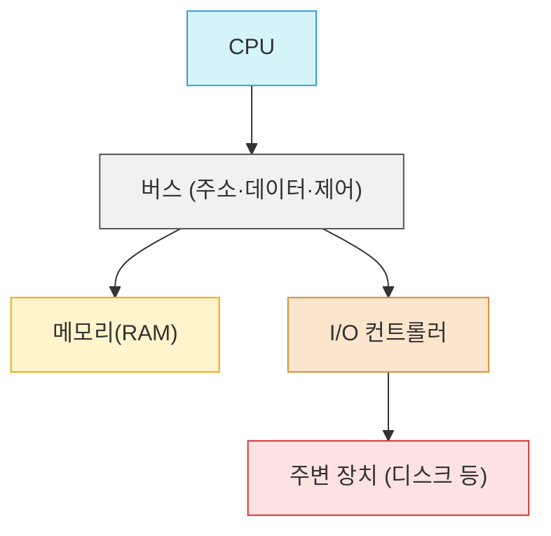

# 개략적인 규모 측정

보편적으로 통용되는 성능 수치를 바탕으로 사고실험을 하여 추정치를 계산하는 행위.  
어떤 설계가 요구사항에 부합할지 보기 위한 도구.  
이를 잘하려면 2의 제곱수, 응답지연 값, 고가용성 관련 수치를 기본적으로 이해해야 한다.

## 모든 프로그래머가 알아야 하는 응답지연 값

| 영역            | 연산                       | 지연 시간  | 비고                      |
| ------------- | ------------------------ |--------| ----------------------- |
| **CPU/캐시**    | L1 캐시 참조                 | 0.5 ns | CPU 코어 내부, 가장 빠른 데이터 접근 |
|               | 분기 예측 오류                 | 5 ns   | 잘못된 분기 → 파이프라인 플러시 비용   |
|               | L2 캐시 참조                 | 7 ns   | L1보다 느리지만 여전히 ns급       |
|               | 뮤텍스 락/언락                 | 100 ns | 경합 없을 때 원자적 락/언락        |
| **메모리(RAM)**  | 주 메모리 참조 (DRAM)          | 100 ns | 캐시 미스 발생 시 DRAM 접근      |
| **CPU 연산/압축** | Zippy로 1KB 압축            | 10 µs  | 단순 압축, CPU 캐시 친화적       |
| **네트워크(근거리)** | 1Gbps 네트워크로 2KB 전송       | 20 µs  | NIC 처리 + 전송 지연          |
| **메모리 전송**    | 메모리에서 1MB 순차적으로 READ     | 250 µs | DRAM 대역폭 한계             |
| **네트워크(RTT)** | 같은 데이터센터 내에서 메시지 왕복 지연시간 | 500 µs | 로컬 네트워크 레이턴시            |
| **스토리지(HDD)** | 디스크 탐색 (Seek)            | 10 ms  | 기계적 헤드 이동, 랜덤 I/O 최악    |
| **네트워크(원거리)** | 네트워크에 1MB 순차적으로 READ     | 10 ms  | WAN 전송 지연               |
| **스토리지(HDD)** | 디스크에서 1MB 순차적으로 READ     | 30 ms  | 플래터 회전하며 순차 읽기          |
| **네트워크(원거리)** | 한 패킷의 CA → 네덜란드 왕복 지연시간  | 150 ms | 대륙 간 왕복 (해저케이블)         |

- 메모리는 빠르지만 디스크는 아직 느리다.
- 디스크 탐색(seek)은 가능한 피하라.
- 단순한 압축 알고리즘은 빠르다.
- 데이터를 인터넷으로 전송하기 전에 가능하면 압축하라.
- 데이터 센터는 보통 여러 지역에 분산되어 있고, 센터들 간에 데이터를 주고받는 데 시간이 걸린다.

### 왜 메모리는 디스크보다 빠를까?

- **위치**: 메모리는 CPU 버스 직결, 디스크는 I/O 컨트롤러, **버스 거침**
- **접근 방식**: 메모리는 전자 신호, 디스크는 물리적 탐색(헤드 이동, 회전 대기)
  - 그래서 **나노초(ns)** vs **밀리초(ms)** -> 백만배 차이

### 디스크 탐색을 피해야 하는 이유
- HDD는 **랜덤 접근 시마다 헤드가 물리적으로 움직여야** 해서 **수 ms 지연**발생
- SSD도 랜덤 읽기는 DRAM에 비해 **수천 배 느림**
- 따라서 **순차 I/O, 배치처리, 로그 구조(append-only), 캐싱**으로 **랜덤 탐색 최소화** 필수

### 단순한 압축 알고리즘이 빠른 이유
- LZ4, Snappy 같은 압축은 $O(n)$ 선형 시간, CPU 캐시 친화적이다. -> 수백 MS/s 이상 처리 가능
- 네트워크/디스크 전송은 상대적으로 훨씬 느리므로, **CPU 조금 쓰고 전송량을 줄이는게 더 이득이다**
- 즉 **비교적 저렴한 CPU를 사용하고, 비싼 I/O를 아끼는 구조**

## QPS 저장소 요구량 추정

- DAU = MAU x 일간 활성 비율
- 평균 QPS = DAU x 일 트윗 수 / 86,400
- 최대 QPS = 평균 QPS x 피크 계수
- 텍스트 저장량 = 일 트윗 수 x 트윗 크기 x 보관 기간
- 미디어 저장량 = 일 트윗 수 x 미디어 비율 x 미디어 크기 x 보관 기간